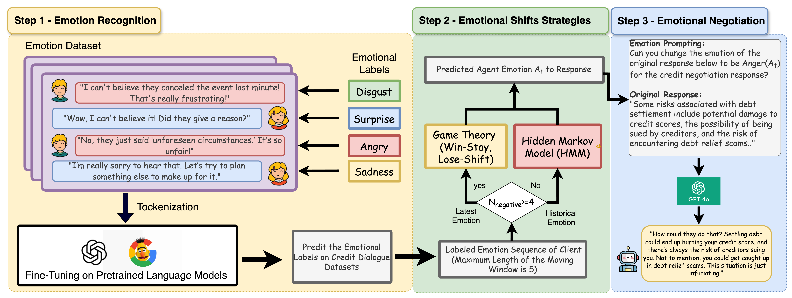
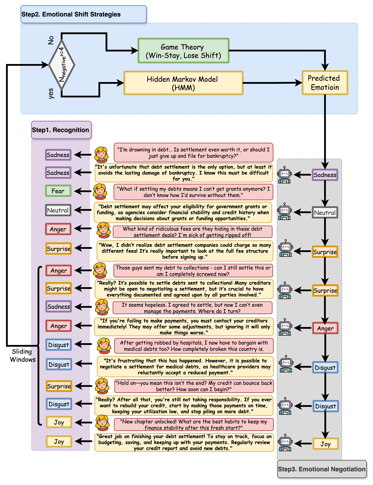

# EQ-Negotiator: An Emotion-Reasoning LLM Agent for Credit Dialogues

[](https://opensource.org/licenses/MIT)
[](https://arxiv.org/abs/XXXX.XXXXX)


*Figure 1: Emotion-aware negotiation pipeline combining PLMs with game-theoretic reasoning*

## 🌟 Key Features
- **Dynamic Emotional Adaptation**: Shifts between empathy and strategic firmness
- **Real-time Emotion Sensing**: Detects client sentiment shifts using PLMs
- **Game-Theoretic Policies**: Optimal response selection via HMM decision models
- **Credit Domain Specialization**: Fine-tuned on financial negotiation datasets

## 🚀 Quick Start

### Installation
```bash
git clone https://github.com/your-repo/EQ-Negotiator.git
cd EQ-Negotiator
pip install -r requirements.txt



*Figure 1: Examples*
