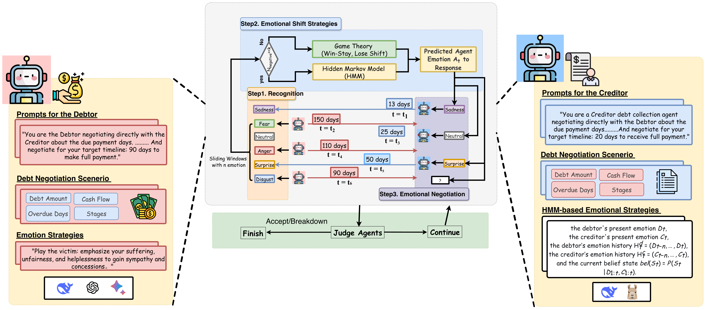

# EQ-Negotiator: Dynamic Emotional Personas Empower Small Language Models for Edge-Deployable Credit Negotiation

[](https://arxiv.org/abs/2511.03370)
[](https://neurips.cc/virtual/2025/loc/mexico-city/129929)
[](https://huggingface.co/papers/2503.21080)

> **Accepted at NeurIPS 2025** — The 39th Annual Conference on Neural Information Processing Systems.



**EQ-Negotiator** is a novel framework that bridges the capability gap between Small Language Models (SLMs) and Large Language Models (LLMs) in emotionally charged credit negotiations. By integrating game theory (Win-Stay, Lose-Shift) with Hidden Markov Models, EQ-Negotiator dynamically adapts emotional strategies in real-time, enabling a 7B parameter model to achieve better debt recovery and negotiation efficiency than baseline LLMs more than 10x its size.

**Authors:** Yuhan Liu (University of Toronto), Yunbo Long (University of Cambridge), Alexandra Brintrup (University of Cambridge, The Alan Turing Institute)

## 🌟 Key Features

- 🧠 **HMM-based Emotional Strategy**: Hidden Markov Model with Bayesian filtering tracks debtor emotional states online without pre-training
- ⚔️ **Game-Theoretic Reasoning**: Win-Stay, Lose-Shift (WSLS) payoff strategy for optimal emotion selection
- 🔄 **Dynamic Policy Switching**: Automatically switches between WSLS and HMM when adversarial debtor behavior is detected
- 🏠 **Edge-Deployable**: Designed for privacy-preserving on-device deployment with 7B parameter SLMs
- 🎭 **Adversarial Robustness**: Tested against 9 debtor personas including threatening, cheating, victim-playing, and stonewalling tactics
- 🤖 **Multi-Model Support**: Works with GPT-4o-mini, GPT-5-mini, DeepSeek-7B, Llama-7B, and Claude

## 🏗️ System Architecture

The system operates through three steps:
1. **Step 1 - Emotion Recognition**: In-context detection of debtor emotions (7 states: Joy, Sadness, Anger, Fear, Surprise, Disgust, Neutral)
2. **Step 2 - Emotional Shift Strategy**: If negative emotions persist (>=k in n turns), HMM activates; otherwise WSLS selects optimal response
3. **Step 3 - Emotional Negotiation**: Creditor responds with strategically selected emotional tone via LLM prompting

Three specialized agents coordinate via LangGraph:
- **Creditor Agent** — equipped with EQ-Negotiator emotion engine
- **Debtor Agent** — configurable with diverse emotional personas
- **Judge Agent** — monitors for agreement/breakdown

## 📁 Project Structure

```
EQ-Negotiator/
├── main.py                          # Entry point
├── config/scenarios.json            # CRAD dataset (100 scenarios)
├── experiments/
│   └── run_eq_negotiator.py         # Experiment runner
├── llm/
│   ├── llm_wrapper.py               # LLM interface (GPT, Claude, DeepSeek, Llama)
│   └── negotiator.py                # Multi-agent negotiation (LangGraph)
├── models/
│   ├── constants.py                 # Emotions, matrices (Tables 4-5 from paper)
│   ├── hmm_model.py                 # HMM emotional strategy (Eq. 2-6)
│   ├── payoff_matrix.py             # WSLS game theory (Eq. 1)
│   └── eq_negotiator.py             # Main EQ engine with policy switching (Eq. 4)
├── results/                         # Experiment outputs
└── utils/
    └── helpers.py                   # Utilities
```

## 🚀 Quick Start

### Installation

```bash
pip install langchain langchain-openai langgraph numpy scipy python-dotenv
```

### Setup

```bash
# Set your API key
echo "OPENAI_API_KEY=your_key" > .env
```

### Run Experiments

```bash
# Run with vanilla debtor (baseline)
python main.py --model_creditor gpt-4o-mini --scenarios 5

# Run with adversarial debtor personas
python main.py --debtor_persona angry --scenarios 5
python main.py --debtor_persona threatening --scenarios 5
python main.py --debtor_persona cheating --scenarios 5

# Run across all 9 personas
python main.py --debtor_persona all --iterations 3 --scenarios 10

# Test with edge-deployable SLMs (requires local GPU)
python main.py --model_creditor deepseek-7b --debtor_persona angry --scenarios 5
python main.py --model_creditor llama-7b --debtor_persona all --scenarios 5
```

### Parameters

| Parameter | Description | Options | Default |
|-----------|-------------|---------|---------|
| `--model_creditor` | Creditor LLM | `gpt-4o-mini`, `gpt-5-mini`, `deepseek-7b`, `llama-7b` | `gpt-4o-mini` |
| `--model_debtor` | Debtor LLM | Same as above | `gpt-4o-mini` |
| `--debtor_persona` | Debtor strategy | `vanilla`, `angry`, `sad`, `fear`, `disgust`, `threatening`, `cheating`, `victim`, `stonewalling`, `all` | `vanilla` |
| `--iterations` | Learning iterations | 1-50 | `3` |
| `--scenarios` | Number of debt cases | 1-100 | `3` |
| `--max_dialog` | Max conversation turns | 5-100 | `30` |

## 📚 Citation

If you use EQ-Negotiator in your research, please cite:

```bibtex
@inproceedings{liu2025eq,
    title={EQ-Negotiator: Dynamic Emotional Personas Empower Small Language Models for Edge-Deployable Credit Negotiation},
    author={Liu, Yuhan and Long, Yunbo and Brintrup, Alexandra},
    booktitle={Advances in Neural Information Processing Systems (NeurIPS)},
    year={2025},
    url={https://arxiv.org/abs/2511.03370}
}
```

## 📄 License

This project is licensed under the MIT License.
